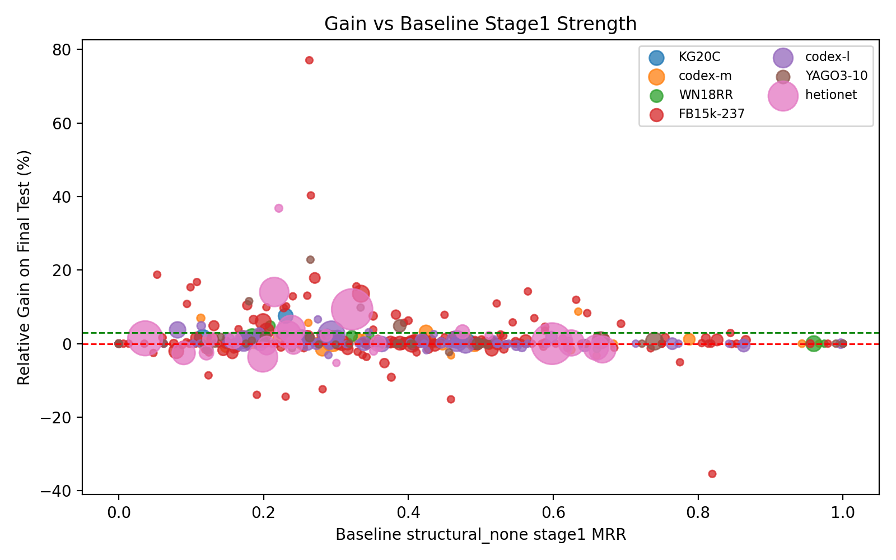
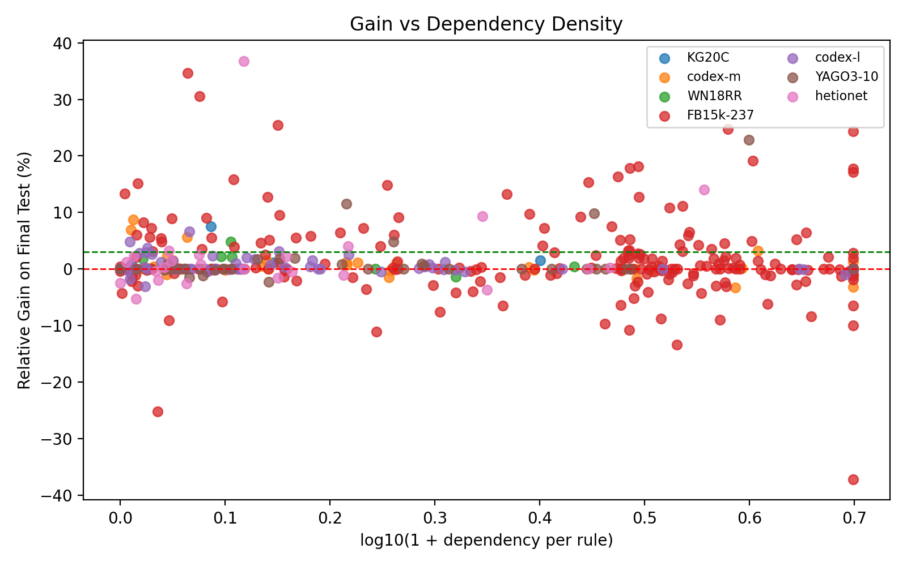
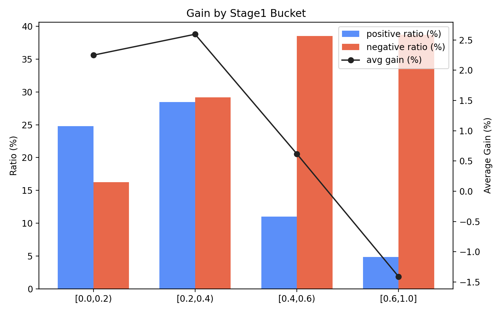
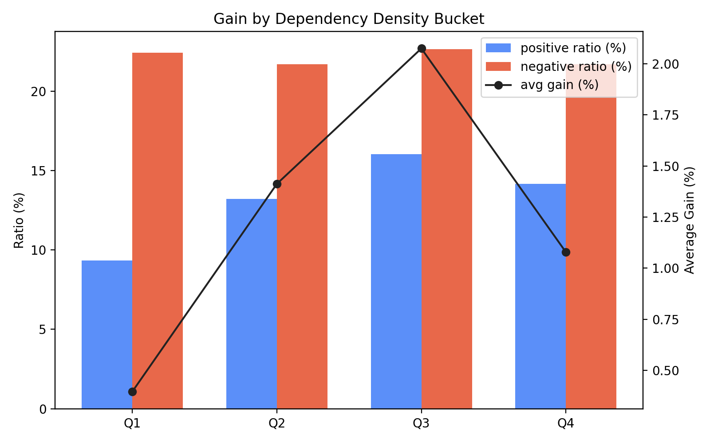
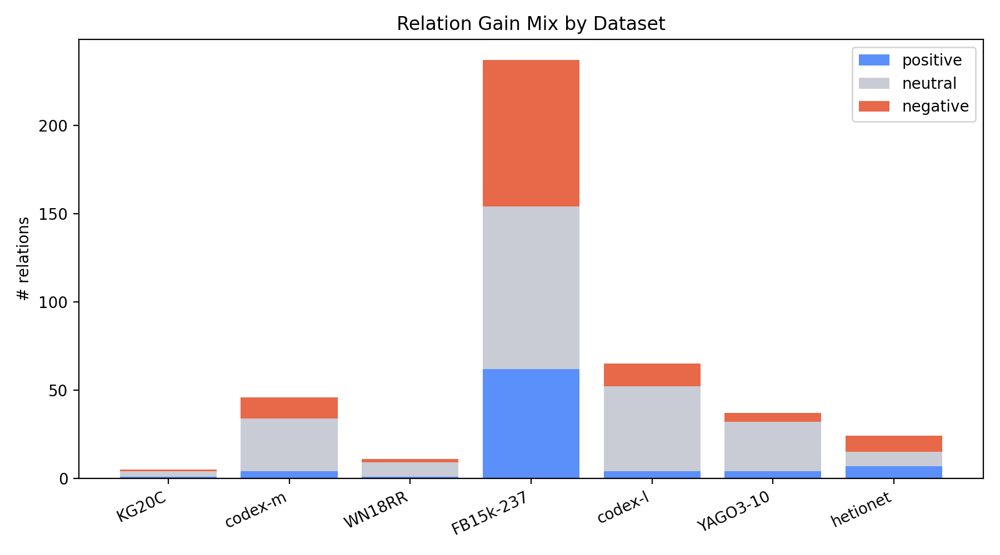
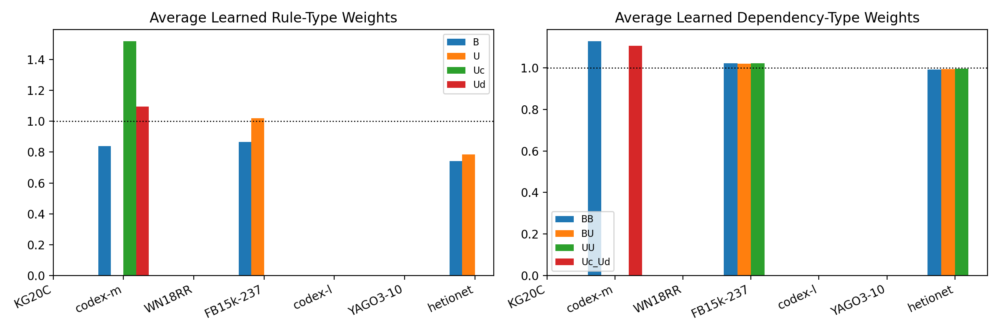

# 0407 Relation-wise Analysis

本节关注一个更细粒度的问题：当我们在数据集级别选定最优 aggregation 配置之后，dependency 究竟改善了哪些 relation，又在哪些 relation 上带来了负迁移。

相关表格：

- `relation_dependency_analysis.csv`
- `relation_gain_group_summary.csv`
- `relation_gain_dataset_summary.csv`
- `relation_gain_stage1_bucket_summary.csv`
- `relation_gain_dep_density_bucket_summary.csv`
- `relation_relative_gain_gt_3pct_best_config.csv`
- `relation_relative_gain_lt_0_best_config.csv`

实验口径如下：

- `baseline = structural_none stage1 test_mrr`
- `final = best_config final test_mrr`
- `rel_gain_pct = 100 * (final - baseline) / baseline`

各数据集使用的数据集级最优配置如下：

- `KG20C` -> `init_dep_with_lift`
- `codex-m` -> `structural_r3d6`
- `WN18RR` -> `structural_rd`
- `FB15k-237` -> `best_combination`
- `codex-l` -> `structural_dep_scale`
- `YAGO3-10` -> `structural_dep_scale`
- `hetionet` -> `dep_scale_surprisal_init`

## Main Findings

在全部 `425` 个 relation 中，`77` 个 relation 的相对增益超过 `3%`，`225` 个 relation 落在 `0%-3%` 的稳定提升区间，另有 `123` 个 relation 出现负迁移。整体上，dependency 的收益并不是均匀分布的，而更像是集中出现在一批“baseline 尚未饱和但结构信号较强”的 relation 上。

<em>Figure 1: relation-level relative gain versus stage1 baseline MRR.</em>

<em>Figure 2: relation-level relative gain versus dependency density.</em>

## Positive vs Negative Relations

正增益 relation 的平均 stage1 MRR 为 `0.28299`，低于负增益 relation 的 `0.43039`；而其平均 dependency density 为 `1.28069`，高于负增益 relation 的 `1.65031`。 这说明 dependency 更容易帮助那些仍有提升空间、且规则交互相对更密的 relation。

进一步看中位数统计，正增益 relation 的典型规模特征如下：

- `train triples` 中位数：`788.00000`，负增益为 `664.00000`
- `test triples` 中位数：`34.00000`，负增益为 `36.00000`
- `#rules` 中位数：`1396.00000`，负增益为 `1211.00000`
- `#dependencies` 中位数：`1189.00000`，负增益为 `1981.00000`
- `dep_per_rule` 中位数：`0.79740`，负增益为 `1.31732`

按最终被选中的 stage 看，正增益 relation 更常落在 dependency stage：

- 正增益 relation：`dependency = 53`，`rule_only = 24`
- 负增益 relation：`dependency = 82`，`rule_only = 41`

<em>Figure 3: average gain across stage1 baseline buckets.</em>

<em>Figure 4: average gain across dependency-density buckets.</em>

## Dataset-level Pattern

不同数据集上的 relation-level 增益分布差异明显，说明 dependency 的收益不仅取决于单个 relation 的局部结构，也取决于整个数据集的规则池与候选依赖边的质量。

| Dataset | Config | Positive | Neutral | Negative | Avg gain pct |
| --- | --- | ---: | ---: | ---: | ---: |
| KG20C | init_dep_with_lift | 1 | 3 | 1 | 2.18316 |
| codex-m | structural_r3d6 | 4 | 30 | 12 | 0.55821 |
| WN18RR | structural_rd | 1 | 8 | 2 | 0.90663 |
| FB15k-237 | best_combination | 62 | 92 | 83 | 1.66240 |
| codex-l | structural_dep_scale | 4 | 48 | 13 | 0.57201 |
| YAGO3-10 | structural_dep_scale | 4 | 28 | 5 | 1.41338 |
| hetionet | dep_scale_surprisal_init | 1 | 16 | 7 | 0.98626 |

<em>Figure 5: positive, neutral, and negative relation counts across datasets.</em>

<em>Figure 6: average learned type weights associated with relation-level gain.</em>

## Representative Positive Relations

代表性正例并不一定是训练样本最多的 relation。更常见的模式是：baseline 已经有可用规则信号，但尚未饱和；同时规则数与 dependency 数达到一定规模，从而允许模型通过 rule interaction 做进一步修正。

- baseline stage1 还没有饱和，但已经有一定 rule 信号
- 往往拥有中等到偏高的 rule 数和 dependency 数
- 很多例子最终还是选择了 `dependency` stage，而不是只靠更强的 stage1
- 更适合被多条互补规则共同支持

表格文件 `relation_relative_gain_gt_3pct_best_config.csv` 给出了完整列表，下面列出最有代表性的正例及其规模信息：

- `FB15k-237` / `/base/popstra/celebrity/friendship./base/popstra/friendship/participant`: baseline `0.05312`, final `0.07153`, rel_gain `34.65679%`, `train=1511`, `test=32`, `rules=2911`, `deps=464`, `dep_per_rule=0.15940`, `selected_stage=rule_only`
- `FB15k-237` / `/film/film/film_festivals`: baseline `0.19895`, final `0.25978`, rel_gain `30.57209%`, `train=264`, `test=18`, `rules=827`, `deps=157`, `dep_per_rule=0.18984`, `selected_stage=dependency`
- `FB15k-237` / `/music/genre/parent_genre`: baseline `0.16270`, final `0.20418`, rel_gain `25.49437%`, `train=678`, `test=97`, `rules=454`, `deps=188`, `dep_per_rule=0.41410`, `selected_stage=rule_only`
- `FB15k-237` / `/military/military_combatant/military_conflicts./military/military_combatant_group/combatants`: baseline `0.26036`, final `0.32488`, rel_gain `24.78345%`, `train=747`, `test=17`, `rules=28658`, `deps=80136`, `dep_per_rule=2.79629`, `selected_stage=dependency`
- `FB15k-237` / `/location/country/official_language`: baseline `0.27862`, final `0.34660`, rel_gain `24.40022%`, `train=225`, `test=16`, `rules=991`, `deps=3964`, `dep_per_rule=4.00000`, `selected_stage=rule_only`
- `YAGO3-10` / `dealsWith`: baseline `0.26473`, final `0.32516`, rel_gain `22.82627%`, `train=1302`, `test=7`, `rules=5173`, `deps=15381`, `dep_per_rule=2.97332`, `selected_stage=dependency`
- `FB15k-237` / `/award/award_nominee/award_nominations./award/award_nomination/award_nominee`: baseline `0.27075`, final `0.32256`, rel_gain `19.13285%`, `train=15989`, `test=214`, `rules=126142`, `deps=379530`, `dep_per_rule=3.00875`, `selected_stage=dependency`
- `FB15k-237` / `/music/performance_role/regular_performances./music/group_membership/role`: baseline `0.09913`, final `0.11709`, rel_gain `18.12076%`, `train=2655`, `test=40`, `rules=91633`, `deps=194070`, `dep_per_rule=2.11791`, `selected_stage=rule_only`
- `FB15k-237` / `/award/award_winning_work/awards_won./award/award_honor/award`: baseline `0.17743`, final `0.20912`, rel_gain `17.86588%`, `train=3310`, `test=118`, `rules=19741`, `deps=40669`, `dep_per_rule=2.06013`, `selected_stage=dependency`
- `FB15k-237` / `/award/award_winner/awards_won./award/award_honor/award_winner`: baseline `0.26534`, final `0.31252`, rel_gain `17.78089%`, `train=8423`, `test=41`, `rules=79116`, `deps=316464`, `dep_per_rule=4.00000`, `selected_stage=rule_only`

从这些代表性正例可以看到两类模式：

- 一类是 `FB15k-237` 上那种高规则数、高 dependency 数的 dense relation，dependency 更像是在已有 rule pool 上做强组合。
- 另一类是 `hetionet: DrD` 这种规模并不大、但结构很明确的 relation，少量高质量 dependency 也能带来明显收益。

## Representative Negative Relations

负例通常对应两种风险：其一是 baseline 本身已经较强，额外 dependency 容易过修正；其二是 dependency 虽多，但质量不稳定，valid 侧的偏好无法稳定迁移到 test。

- `FB15k-237` / `/base/locations/continents/countries_within`: baseline `0.81961`, final `0.51488`, rel_gain `-37.17981%`, selected_stage `dependency`
- `FB15k-237` / `/music/artist/origin`: baseline `0.15966`, final `0.11940`, rel_gain `-25.22008%`, selected_stage `rule_only`
- `FB15k-237` / `/sports/sports_team/roster./baseball/baseball_roster_position/position`: baseline `0.64444`, final `0.55833`, rel_gain `-13.36207%`, selected_stage `dependency`
- `FB15k-237` / `/film/film/film_art_direction_by`: baseline `0.75000`, final `0.66667`, rel_gain `-11.11111%`, selected_stage `rule_only`
- `FB15k-237` / `/music/group_member/membership./music/group_membership/role`: baseline `0.25564`, final `0.22805`, rel_gain `-10.78991%`, selected_stage `dependency`
- `FB15k-237` / `/organization/non_profit_organization/registered_with./organization/non_profit_registration/registering_agency`: baseline `0.77494`, final `0.69759`, rel_gain `-9.98077%`, selected_stage `dependency`
- `FB15k-237` / `/location/location/partially_contains`: baseline `0.32828`, final `0.29660`, rel_gain `-9.65049%`, selected_stage `rule_only`
- `FB15k-237` / `/celebrities/celebrity/celebrity_friends./celebrities/friendship/friend`: baseline `0.06144`, final `0.05588`, rel_gain `-9.04255%`, selected_stage `rule_only`
- `FB15k-237` / `/olympics/olympic_participating_country/medals_won./olympics/olympic_medal_honor/olympics`: baseline `0.37638`, final `0.34256`, rel_gain `-8.98724%`, selected_stage `rule_only`
- `FB15k-237` / `/education/educational_institution/students_graduates./education/education/major_field_of_study`: baseline `0.23666`, final `0.21592`, rel_gain `-8.76611%`, selected_stage `rule_only`
