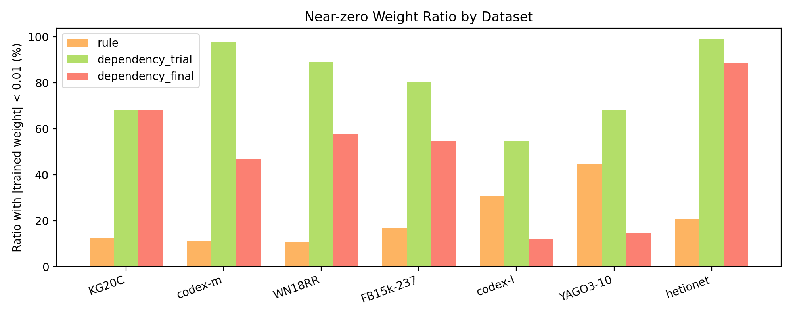
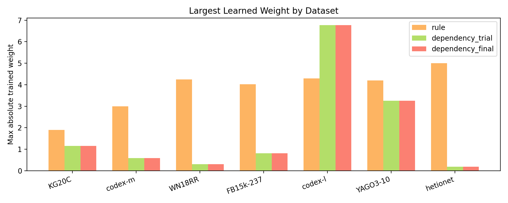
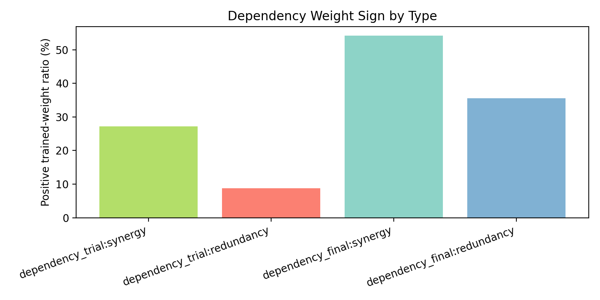

# 0407 Rule / Dependency Weight Analysis

本节沿用第 2 部分的 best config，考察 rule 与 dependency 的参数在训练前后如何变化，以及模型最终是否会把大量 dependency 权重压回到接近零的区域。

相关表格：

- `best_config_weight_summary.csv`
- `dependency_sign_by_type.csv`

<em>Figure 1: near-zero ratio of learned rule and dependency weights.</em>

<em>Figure 2: maximum absolute value of learned rule and dependency weights.</em>

<em>Figure 3: positive-weight ratio of synergy and redundancy dependencies before and after selection.</em>

## Definition of `dependency_trial` and `dependency_final`

为避免歧义，这里明确第 5 部分的两个 dependency 统计对象：

- `dependency_trial`：来自 `dependency-trial-<relation>.csv`。它表示 relation 上一旦实际训练了 dependency stage，就把该 stage 学到的 dependency 权重记下来，不要求这个 stage 最终被接受。换句话说，`trial` 反映的是“候选 dependency stage 训练后会学成什么样”。
- `dependency_final`：来自 `dependency-final-<relation>.csv`。它只在 dependency stage 的 best valid 表现超过 rule-only stage、并且最终被模型选择时才会出现。也就是说，`final` 反映的是“真正进入最终测试输出的 dependency 权重”。

因此，`trial` 和 `final` 的差别不只是训练前后两个时间点，而是“尝试过的 dependency 模型”与“最终被接受的 dependency 模型”的区别。通常 `final` 会比 `trial` 更稀疏，因为它已经经过了一次 relation-level model selection。

## Dataset Summary

| Dataset | Config | Rule near-zero | Dep trial near-zero | Dep final near-zero | Rule max abs | Dep trial max abs | Dep final max abs |
| --- | --- | ---: | ---: | ---: | ---: | ---: | ---: |
| KG20C | init_dep_with_lift | 12.48470 | 68.11450 | 68.11450 | 1.90228 | 1.15098 | 1.15098 |
| codex-m | structural_r3d6 | 11.38830 | 97.62060 | 46.79880 | 2.99124 | 0.58873 | 0.58873 |
| WN18RR | structural_rd | 10.75430 | 89.07810 | 57.69790 | 4.24963 | 0.30246 | 0.30246 |
| FB15k-237 | structural_r2d3 | 16.69570 | 80.56860 | 54.67160 | 4.02744 | 0.80798 | 0.80798 |
| codex-l | structural_dep_scale | 30.90220 | 54.59180 | 12.21260 | 4.29032 | 6.76793 | 6.76793 |
| YAGO3-10 | structural_dep_scale | 44.85790 | 68.05020 | 14.59040 | 4.20227 | 3.25249 | 3.25249 |
| hetionet | structural_r2d3 | 20.78810 | 98.94870 | 88.67860 | 4.99785 | 0.18869 | 0.18869 |

## Dependency Sign vs Type

在 trial 阶段，`synergy` 的平均正权重比例为 `27.18034%`，`redundancy` 为 `8.75647%`。
经过最终选择后，`synergy` 的平均正权重比例上升到 `54.19174%`，`redundancy` 也上升到 `35.56521%`。

## Global View

rule 权重的平均绝对变化为 `0.26399`，dependency 在 trial 与 final 阶段分别为 `0.02309` 和 `0.05651`。
近零比例方面，rule 权重均值为 `21.12446%`，dependency 在 trial 阶段为 `79.56750%`，final 阶段为 `48.96634%`。

## Interpretation

这些结果共同说明，模型确实会主动稀疏化大量 dependency 边，尤其是在 trial 阶段，许多候选边最终被压回到零附近。与此同时，少数被保留下来的 dependency 仍可能具有较大的绝对权重，因此它们更像是稀疏但强烈的修正项，而不是均匀分布在所有规则对上的微弱偏置。

从符号分布看，`synergy` 更容易获得正权重，而 `redundancy` 通常更保守，这与依赖类型本身的语义方向基本一致，但并不是绝对的一一对应关系。最终被选择进入 final 阶段的 dependency，往往是那些既能在 valid 上稳定受益、又没有明显过拟合迹象的边。
