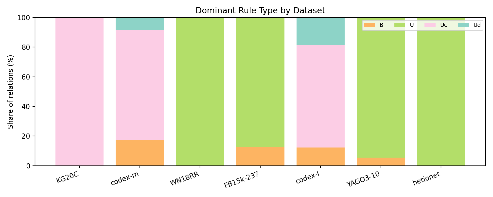
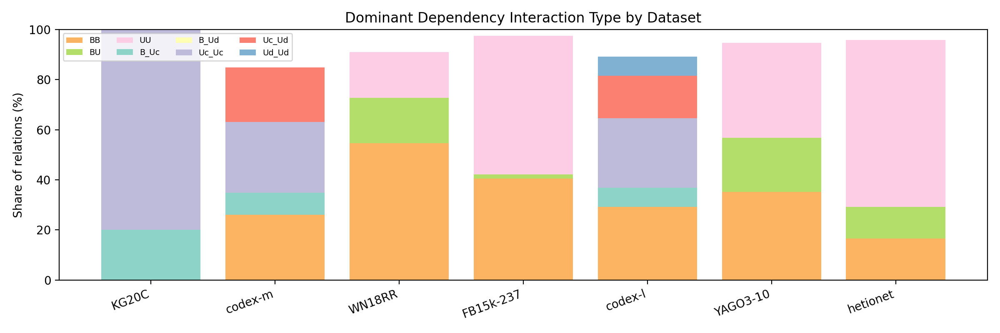
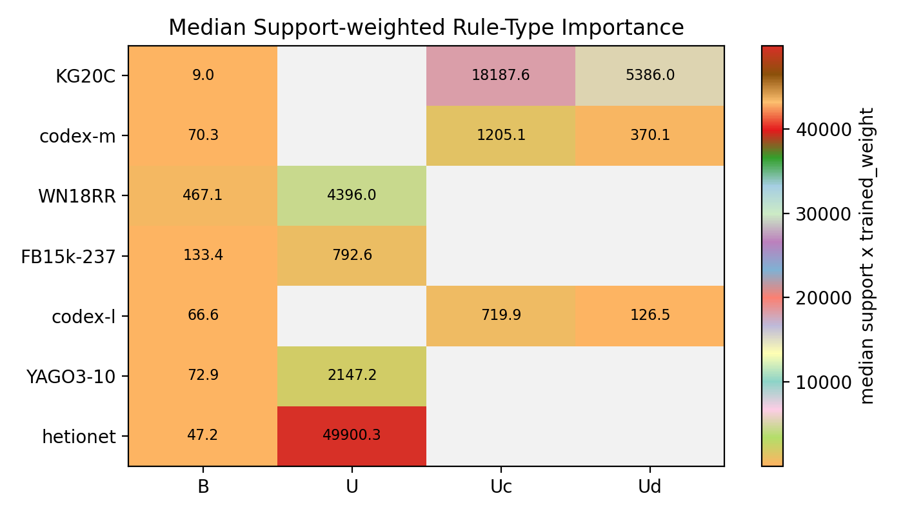

# 0407 Type-weight Analysis

注：

- 本页已按当前最新已完成实验重生成。
- `hetionet` 的 2026-04-08 targeted follow-up 尚未完成，因此这里关于跨数据集的 typed 配置结论不把 `hetionet` 的该批新实验计入。

这一节不再把 type weight 直接做成单个实验级平均值，而是回到 relation 粒度来问：在每个数据集最优的 typed 实验里，究竟是哪一类 rule type 或 dependency interaction 真正在起作用。

这里将某个 type 在一个 relation 上的重要性定义为：`support x trained_weight`。

- `trained_weight` 是最终学到的乘性系数，因此权重越大，说明模型越愿意放大该 type 的贡献。
- `support` 反映这个 type 在该 relation 上覆盖了多少规则或 rule pair。
- 因而 `support x trained_weight` 可以理解为该 type 在 relation 上的总“有效质量”；若某个 type 的权重小于 `1`，它的相对重要性也会自然下降。

相关表格：

- `best_typed_experiment_by_dataset.csv`
- `relation_type_weight_importance.csv`
- `dataset_type_weight_summary.csv`
- `global_type_weight_summary.csv`

<em>Figure 1: share of relations whose dominant rule type is B / U / Uc / Ud in each dataset.</em>

<em>Figure 2: share of relations whose dominant dependency interaction type differs across datasets.</em>

<em>Figure 3: median support-weighted importance of each rule type in each dataset.</em>

## Best Typed Experiment Per Dataset

为了避免把“是否使用 type weight”与“type weight 学成什么样”混在一起，这里先对每个数据集只在显式带 type weight 的实验中选一个最优配置，即 `r2d3` 与 `r3d6` 二选一。

| Dataset | Best typed experiment | Grouping | Test MRR | Top rule type | Top dependency type |
| --- | --- | --- | ---: | --- | --- |
| KG20C | structural_r3d6 | r3d6 | 0.22829 | Uc | Uc_Uc |
| codex-m | structural_r3d6 | r3d6 | 0.34330 | Uc | Uc_Uc |
| WN18RR | structural_r2d3 | r2d3 | 0.49923 | U | BB |
| FB15k-237 | structural_r2d3 | r2d3 | 0.35156 | U | UU |
| codex-l | structural_r3d6 | r3d6 | 0.33173 | Uc | BB |
| YAGO3-10 | structural_r2d3 | r2d3 | 0.57666 | U | UU |
| hetionet | structural_r2d3 | r2d3 | 0.36985 | U | UU |

## Dataset-level Pattern

在这批结果中，最佳 typed 实验的 grouping 分布为 `r2d3 = 4`，`r3d6 = 3`。 但这一步只是选择分析入口，真正关键的是进入该实验后，不同 relation 对不同 type 的偏好是否一致。

按 relation 计数，整体上最常成为主导项的 rule type 是 `U`，最常成为主导项的 dependency interaction 是 `UU`。

如果只在能观测到 `B / Uc / Ud` 三类权重的 relation 上检查，满足 `Ud < B < Uc` 的比例为 `18.51852%`。 这比“直接看全局平均值”更合理，因为它保留了 relation 之间的差异。

## Within-dataset Heterogeneity

下面的统计更能说明问题：如果某个数据集所有 relation 都偏好同一种 type，那么它的 dominant-type entropy 会很低；反过来，如果不同 relation 各自依赖不同的 type，entropy 就会更高。

- `KG20C`: dominant rule type 最常见的是 `Uc`，占 `100.00000%`；rule-type entropy 为 `0.00000`，dependency-type entropy 为 `0.72193`。
- `codex-m`: dominant rule type 最常见的是 `Uc`，占 `73.91304%`；rule-type entropy 为 `0.67359`，dependency-type entropy 为 `0.94598`。
- `WN18RR`: dominant rule type 最常见的是 `U`，占 `100.00000%`；rule-type entropy 为 `0.00000`，dependency-type entropy 为 `0.86497`。
- `FB15k-237`: dominant rule type 最常见的是 `U`，占 `87.34177%`；rule-type entropy 为 `0.54799`，dependency-type entropy 为 `0.68889`。
- `codex-l`: dominant rule type 最常见的是 `Uc`，占 `69.23077%`；rule-type entropy 为 `0.75033`，dependency-type entropy 为 `0.91126`。
- `YAGO3-10`: dominant rule type 最常见的是 `U`，占 `94.59459%`；rule-type entropy 为 `0.30337`，dependency-type entropy 为 `0.97553`。
- `hetionet`: dominant rule type 最常见的是 `U`，占 `100.00000%`；rule-type entropy 为 `0.00000`，dependency-type entropy 为 `0.74853`。

## What Is Important In Each Dataset

如果把“更重要”理解为 `support x trained_weight` 更高，那么不同数据集的主导 type 确实明显不同。

- `KG20C`: rule 侧最重要的 type 是 `Uc`，median importance `18187.58476`；dependency 侧最重要的 interaction 是 `B_Uc`，median importance `5023.00000`。
- `codex-m`: rule 侧最重要的 type 是 `Uc`，median importance `1205.14665`；dependency 侧最重要的 interaction 是 `Uc_Uc`，median importance `373.00000`。
- `WN18RR`: rule 侧最重要的 type 是 `U`，median importance `4396.00000`；dependency 侧最重要的 interaction 是 `BB`，median importance `894.00000`。
- `FB15k-237`: rule 侧最重要的 type 是 `U`，median importance `792.60764`；dependency 侧最重要的 interaction 是 `UU`，median importance `911.00000`。
- `codex-l`: rule 侧最重要的 type 是 `Uc`，median importance `719.91850`；dependency 侧最重要的 interaction 是 `Uc_Uc`，median importance `214.00000`。
- `YAGO3-10`: rule 侧最重要的 type 是 `U`，median importance `2147.15719`；dependency 侧最重要的 interaction 是 `UU`，median importance `448.99504`。
- `hetionet`: rule 侧最重要的 type 是 `U`，median importance `49900.30202`；dependency 侧最重要的 interaction 是 `UU`，median importance `9254.96538`。

## Representative Relation-level Diversity

relation 级别的差异并不会被数据集平均值完全解释。下面列出若干代表性 relation，展示同一数据集内部也会出现不同的主导 type。

- `hetionet` / `GpBP`: dominant rule type = `U`, weight `1.00000`, support `1556327.00000`, importance `1556327.00000`; dominant dependency type = `UU`.
- `YAGO3-10` / `isAffiliatedTo`: dominant rule type = `U`, weight `1.21087`, support `330487.00000`, importance `400175.53784`; dominant dependency type = `BU`.
- `codex-m` / `P106`: dominant rule type = `Uc`, weight `0.89930`, support `256176.00000`, importance `230378.51321`; dominant dependency type = `B_Uc`.
- `codex-l` / `P106`: dominant rule type = `Uc`, weight `2.29815`, support `54249.00000`, importance `124672.40987`; dominant dependency type = `B_Uc`.
- `KG20C` / `paper_in_domain`: dominant rule type = `Uc`, weight `1.00000`, support `93474.00000`, importance `93474.00000`; dominant dependency type = `Uc_Uc`.
- `FB15k-237` / `/film/actor/film./film/performance/film`: dominant rule type = `U`, weight `2.34714`, support `27826.00000`, importance `65311.46755`; dominant dependency type = `BB`.
- `WN18RR` / `_derivationally_related_form`: dominant rule type = `U`, weight `1.00000`, support `42983.00000`, importance `42983.00000`; dominant dependency type = `BU`.
- `codex-l` / `P161`: dominant rule type = `Ud`, weight `1.00000`, support `3884.00000`, importance `3884.00000`; dominant dependency type = `Uc_Uc`.
- `FB15k-237` / `/education/educational_institution_campus/educational_institution`: dominant rule type = `B`, weight `1.00000`, support `907.00000`, importance `907.00000`; dominant dependency type = `-`.
- `codex-l` / `P36`: dominant rule type = `B`, weight `1.23754`, support `111.00000`, importance `137.36680`; dominant dependency type = `BB`.
- `codex-m` / `P57`: dominant rule type = `Ud`, weight `0.96208`, support `85.00000`, importance `81.77691`; dominant dependency type = `B_Uc`.
- `YAGO3-10` / `isMarriedTo`: dominant rule type = `B`, weight `1.00000`, support `71.00000`, importance `71.00000`; dominant dependency type = `BB`.

## Interpretation

这次按 relation 粒度重做后，可以看到 type weight 的作用并不是“整个实验学到一组固定的全局偏好”，而更像是模型针对不同 relation 的局部结构自适应地调整不同 type。

因此，第 4 部分更合理的结论不该是“某个 grouping 的全局平均权重大小关系如何”，而应当是：

- 不同数据集的主导 rule type 和主导 dependency interaction 确实不同。
- 同一数据集内部，不同 relation 的 dominant type 也会显著变化。
- `Ud < B < Uc` 若要分析，也应在 relation 级别或数据集级别检查其成立比例，而不是只看被平均之后的一组数字。
