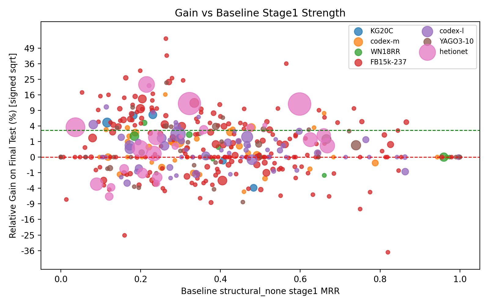
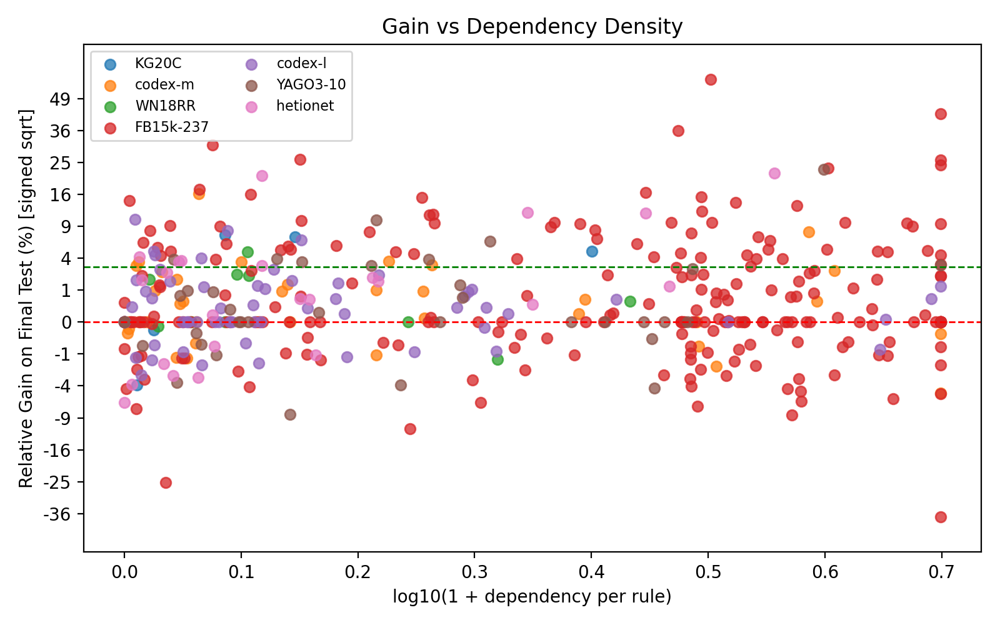
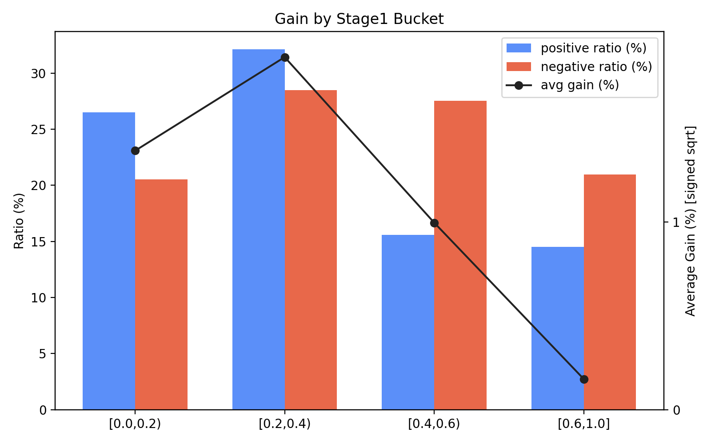
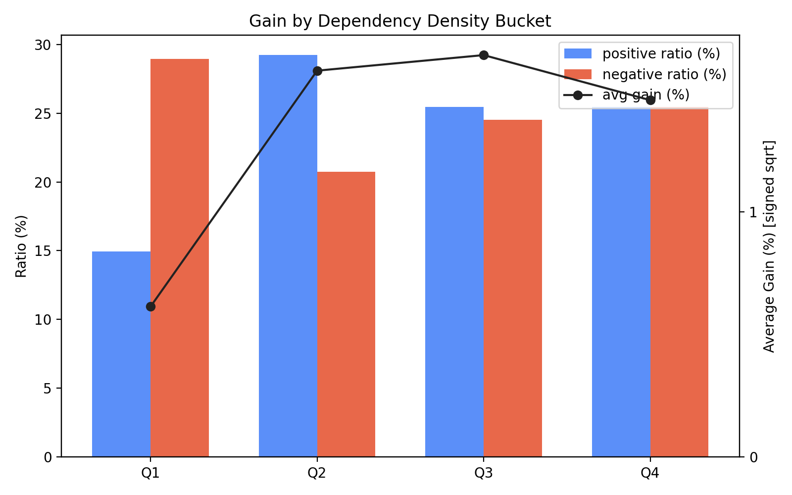
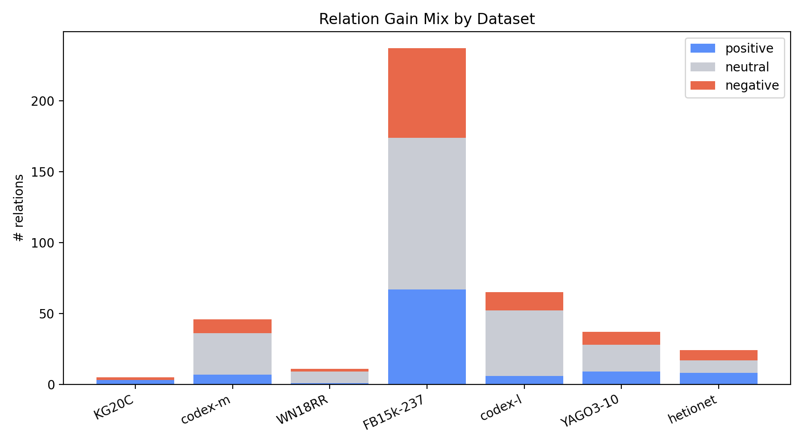
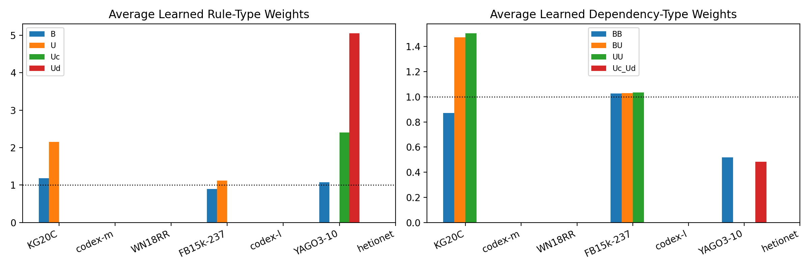

# 0407 Relation-wise Analysis

本节关注一个更细粒度的问题：当我们在数据集级别选定最优 aggregation 配置之后，dependency 究竟改善了哪些 relation，又在哪些 relation 上带来了负迁移。

相关表格：

- `relation_dependency_analysis.csv`
- `relation_gain_group_summary.csv`
- `relation_gain_dataset_summary.csv`
- `relation_gain_stage1_bucket_summary.csv`
- `relation_gain_dep_density_bucket_summary.csv`
- `relation_relative_gain_gt_3pct_best_config.csv`
- `relation_relative_gain_lt_0_best_config.csv`
- `relation_stage2_gain_gt_3pt_best_config.csv`

实验口径如下：

- `baseline = structural_none stage1 test_mrr`
- `final = best_config final test_mrr`
- `rel_gain_pct = 100 * (final - baseline) / baseline`

各数据集使用的数据集级最优配置如下：

- `KG20C` -> `tg_r2d3__pos_auto_ratio__ri_conf__dn_per_rule_degree__dl1_1e-5`
- `codex-m` -> `tg_rd__pos_auto_sqrt__ri_conf__dn_per_rule_degree__dl1_1e-5`
- `WN18RR` -> `structural_rd`
- `FB15k-237` -> `tg_r2d3__pos_auto_ratio__ri_conf__dn_none__dl1_1e-5`
- `codex-l` -> `tg_rd__pos_auto_sqrt__ri_conf__dn_per_rule_degree__dl1_1e-5`
- `YAGO3-10` -> `tg_r3d6__pos_auto_sqrt__ri_surprisal__dn_none__dl1_1e-5`
- `hetionet` -> `tg_rd__pos_auto_ratio__ri_conf__dn_per_rule_degree__dl1_1e-5`

## Main Findings

在全部 `425` 个 relation 中，`101` 个 relation 的相对增益超过 `3%`，`218` 个 relation 落在 `0%-3%` 的稳定提升区间，另有 `106` 个 relation 出现负迁移。整体上，dependency 的收益并不是均匀分布的，而更像是集中出现在一批“baseline 尚未饱和但结构信号较强”的 relation 上。

<em>Figure 1: relation-level relative gain versus stage1 baseline MRR.</em>

<em>Figure 2: relation-level relative gain versus dependency density.</em>

## Positive vs Negative Relations

正增益 relation 的平均 stage1 MRR 为 `0.31113`，低于负增益 relation 的 `0.37396`；而其平均 dependency density 为 `1.40359`，高于负增益 relation 的 `1.31892`。 这说明 dependency 更容易帮助那些仍有提升空间、且规则交互相对更密的 relation。

进一步看中位数统计，正增益 relation 的典型规模特征如下：

- `train triples` 中位数：`852.00000`，负增益为 `923.00000`
- `test triples` 中位数：`55.00000`，负增益为 `41.00000`
- `#rules` 中位数：`1536.00000`，负增益为 `1594.00000`
- `#dependencies` 中位数：`1814.00000`，负增益为 `1439.00000`
- `dep_per_rule` 中位数：`0.83868`，负增益为 `0.98734`

按最终被选中的 stage 看，正增益 relation 更常落在 dependency stage：

- 正增益 relation：`dependency = 74`，`rule_only = 27`
- 负增益 relation：`dependency = 72`，`rule_only = 34`

<em>Figure 3: average gain across stage1 baseline buckets.</em>

<em>Figure 4: average gain across dependency-density buckets.</em>

## Dataset-level Pattern

不同数据集上的 relation-level 增益分布差异明显，说明 dependency 的收益不仅取决于单个 relation 的局部结构，也取决于整个数据集的规则池与候选依赖边的质量。

| Dataset | Config | Positive | Neutral | Negative | Avg gain pct |
| --- | --- | ---: | ---: | ---: | ---: |
| KG20C | tg_r2d3__pos_auto_ratio__ri_conf__dn_per_rule_degree__dl1_1e-5 | 3 | 0 | 2 | 3.09453 |
| codex-m | tg_rd__pos_auto_sqrt__ri_conf__dn_per_rule_degree__dl1_1e-5 | 7 | 29 | 10 | 0.93932 |
| WN18RR | structural_rd | 1 | 8 | 2 | 0.90663 |
| FB15k-237 | tg_r2d3__pos_auto_ratio__ri_conf__dn_none__dl1_1e-5 | 67 | 107 | 63 | 2.43870 |
| codex-l | tg_rd__pos_auto_sqrt__ri_conf__dn_per_rule_degree__dl1_1e-5 | 6 | 46 | 13 | 0.77517 |
| YAGO3-10 | tg_r3d6__pos_auto_sqrt__ri_surprisal__dn_none__dl1_1e-5 | 9 | 19 | 9 | 1.23833 |
| hetionet | tg_rd__pos_auto_ratio__ri_conf__dn_per_rule_degree__dl1_1e-5 | 8 | 9 | 7 | 2.98928 |

<em>Figure 5: positive, neutral, and negative relation counts across datasets.</em>

<em>Figure 6: average learned type weights associated with relation-level gain.</em>

## Representative Positive Relations

代表性正例并不一定是训练样本最多的 relation。更常见的模式是：baseline 已经有可用规则信号，但尚未饱和；同时规则数与 dependency 数达到一定规模，从而允许模型通过 rule interaction 做进一步修正。

- baseline stage1 还没有饱和，但已经有一定 rule 信号
- 往往拥有中等到偏高的 rule 数和 dependency 数
- 很多例子最终还是选择了 `dependency` stage，而不是只靠更强的 stage1
- 更适合被多条互补规则共同支持

表格文件 `relation_relative_gain_gt_3pct_best_config.csv` 给出了完整列表，下面列出最有代表性的正例及其规模信息：

| Dataset | Relation | Baseline | Final | Rel gain | Train | Test | #Rules | #Deps | Dep/Rule | Selected stage |
| --- | --- | ---: | ---: | ---: | ---: | ---: | ---: | ---: | ---: | --- |
| FB15k-237 | /olympics/olympic_games/sports | 0.26323 | 0.41538 | 57.80471% | 664 | 13 | 9650 | 21010 | 2.17720 | dependency |
| FB15k-237 | /award/award_winner/awards_won./award/award_honor/award_winner | 0.26534 | 0.37804 | 42.47328% | 8423 | 41 | 79116 | 316464 | 4.00000 | dependency |
| FB15k-237 | /film/film/distributors./film/film_film_distributor_relationship/region | 0.56497 | 0.76833 | 35.99515% | 157 | 10 | 916 | 1814 | 1.98035 | dependency |
| FB15k-237 | /film/film/film_festivals | 0.19895 | 0.26012 | 30.74384% | 264 | 18 | 827 | 157 | 0.18984 | rule_only |
| FB15k-237 | /music/genre/parent_genre | 0.16270 | 0.20479 | 25.87013% | 678 | 97 | 454 | 188 | 0.41410 | rule_only |
| FB15k-237 | /location/country/official_language | 0.27862 | 0.35018 | 25.68450% | 225 | 16 | 991 | 3964 | 4.00000 | rule_only |
| FB15k-237 | /language/human_language/countries_spoken_in | 0.30643 | 0.38072 | 24.24287% | 335 | 25 | 1883 | 7532 | 4.00000 | dependency |
| FB15k-237 | /award/award_nominee/award_nominations./award/award_nomination/award_nominee | 0.27075 | 0.33360 | 23.21116% | 15989 | 214 | 126142 | 379530 | 3.00875 | dependency |
| YAGO3-10 | dealsWith | 0.26473 | 0.32504 | 22.78170% | 1302 | 7 | 5173 | 15381 | 2.97332 | dependency |
| hetionet | CcSE | 0.21476 | 0.26143 | 21.73180% | 111871 | 13524 | 368314 | 958189 | 2.60155 | rule_only |

从这些代表性正例可以看到两类模式：

- 一类是 `FB15k-237` 上那种高规则数、高 dependency 数的 dense relation，dependency 更像是在已有 rule pool 上做强组合。
- 另一类是 `hetionet: DrD` 这种规模并不大、但结构很明确的 relation，少量高质量 dependency 也能带来明显收益。

## Representative Negative Relations

负例通常对应两种风险：其一是 baseline 本身已经较强，额外 dependency 容易过修正；其二是 dependency 虽多，但质量不稳定，valid 侧的偏好无法稳定迁移到 test。

- `FB15k-237` / `/base/locations/continents/countries_within`: baseline `0.81961`, final `0.51394`, rel_gain `-37.29496%`, selected_stage `dependency`
- `FB15k-237` / `/music/artist/origin`: baseline `0.15966`, final `0.11940`, rel_gain `-25.22063%`, selected_stage `rule_only`
- `FB15k-237` / `/film/film/film_art_direction_by`: baseline `0.75000`, final `0.66667`, rel_gain `-11.11111%`, selected_stage `rule_only`
- `FB15k-237` / `/olympics/olympic_participating_country/medals_won./olympics/olympic_medal_honor/olympics`: baseline `0.37638`, final `0.34443`, rel_gain `-8.48860%`, selected_stage `rule_only`
- `YAGO3-10` / `hasChild`: baseline `0.45617`, final `0.41820`, rel_gain `-8.32250%`, selected_stage `dependency`
- `FB15k-237` / `/base/popstra/celebrity/dated./base/popstra/dated/participant`: baseline `0.01377`, final `0.01275`, rel_gain `-7.40305%`, selected_stage `dependency`
- `FB15k-237` / `/film/director/film`: baseline `0.34902`, final `0.32469`, rel_gain `-6.97012%`, selected_stage `dependency`
- `hetionet` / `DdG`: baseline `0.12117`, final `0.11345`, rel_gain `-6.37357%`, selected_stage `rule_only`
- `FB15k-237` / `/award/award_category/disciplines_or_subjects`: baseline `0.67226`, final `0.62958`, rel_gain `-6.34906%`, selected_stage `rule_only`
- `FB15k-237` / `/base/biblioness/bibs_location/country`: baseline `0.55069`, final `0.51692`, rel_gain `-6.13321%`, selected_stage `dependency`

## Stage2 vs Stage1: Gain pt > 3

以下关系满足 `stage2_gain_vs_selected_stage1 > 0.03`（即提升超过 3 个百分点）。

| Dataset | Relation | Selected stage1 MRR | Final MRR | Stage2 gain (pt) | Selected stage |
| --- | --- | ---: | ---: | ---: | --- |
| FB15k-237 | /film/film/distributors./film/film_film_distributor_relationship/region | 0.57468 | 0.76833 | 19.36490 | dependency |
| FB15k-237 | /award/award_winner/awards_won./award/award_honor/award_winner | 0.24256 | 0.37804 | 13.54773 | dependency |
| FB15k-237 | /olympics/olympic_games/sports | 0.28773 | 0.41538 | 12.76557 | dependency |
| hetionet | GpBP | 0.59828 | 0.66774 | 6.94611 | dependency |
| FB15k-237 | /government/politician/government_positions_held./government/government_position_held/legislative_sessions | 0.74173 | 0.80616 | 6.44329 | dependency |
| FB15k-237 | /location/country/second_level_divisions | 0.64708 | 0.70536 | 5.82805 | dependency |
| YAGO3-10 | happenedIn | 0.37941 | 0.43195 | 5.25380 | dependency |
| FB15k-237 | /language/human_language/countries_spoken_in | 0.33693 | 0.38072 | 4.37927 | dependency |
| FB15k-237 | /location/hud_foreclosure_area/estimated_number_of_mortgages./measurement_unit/dated_integer/source | 0.74990 | 0.79345 | 4.35449 | dependency |
| FB15k-237 | /base/schemastaging/organization_extra/phone_number./base/schemastaging/phone_sandbox/service_language | 0.66070 | 0.70358 | 4.28758 | dependency |
| codex-l | P530 | 0.73541 | 0.77389 | 3.84816 | dependency |
| FB15k-237 | /government/legislative_session/members./government/government_position_held/district_represented | 0.87382 | 0.90942 | 3.55956 | dependency |
| YAGO3-10 | participatedIn | 0.29849 | 0.33305 | 3.45662 | dependency |
| FB15k-237 | /education/educational_institution/school_type | 0.35057 | 0.38475 | 3.41826 | dependency |
| YAGO3-10 | isAffiliatedTo | 0.71005 | 0.74398 | 3.39378 | dependency |
| codex-m | P30 | 0.67916 | 0.71200 | 3.28403 | dependency |
