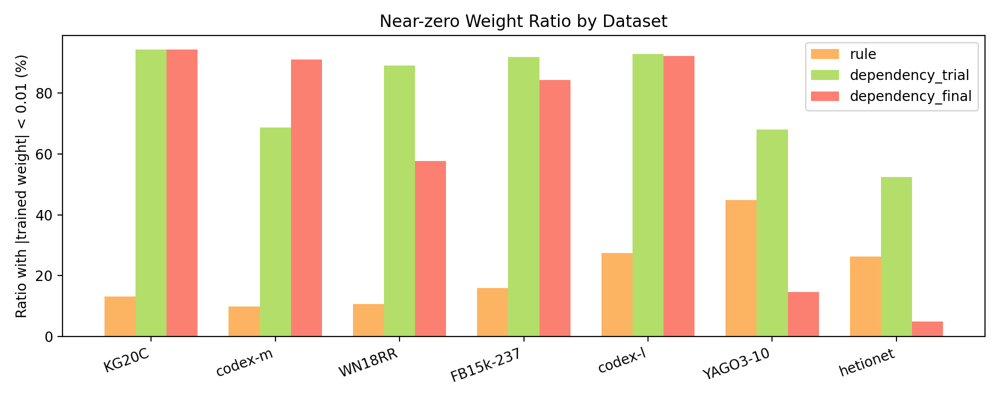
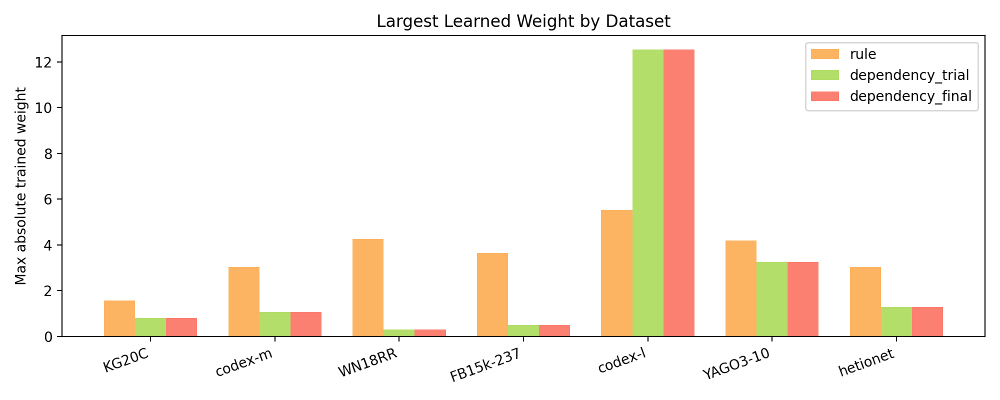
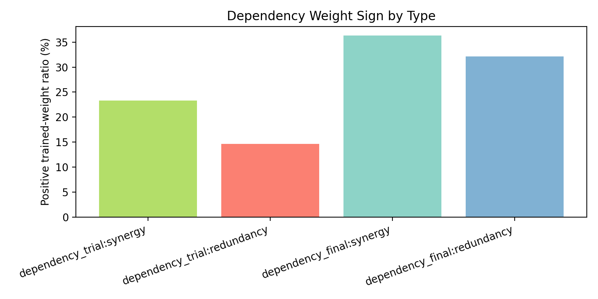

# 0407 Rule / Dependency Weight Analysis

本节沿用第 2 部分的 best config，仅使用 `dependency_final`，考察 rule 与 dependency 的参数变化，以及最终被保留的 dependency 权重分布。

相关表格：

- `best_config_weight_summary.csv`
- `dependency_sign_by_type.csv`

<em>Figure 1: near-zero ratio of learned rule and dependency weights.</em>

<em>Figure 2: maximum absolute value of learned rule and dependency weights.</em>

<em>Figure 3: positive-weight ratio of synergy and redundancy dependencies in dependency_final.</em>

## Definitions (gold-effective metrics)

下面新增 4 个统计，统一基于 `dependency_final` 与阈值 `delta=0.01`，并且都在 gold `(q,c)` 粒度上计算：

- gold 平均有效 Rule 数量：对每个 gold `(q,c)`，统计该候选上 `rule_weight > delta` 的规则条目数，再对所有 gold `(q,c)` 求平均。
- gold 平均有效 Dep 数量：对每个 gold `(q,c)`，统计由激活规则诱导、且 `dep_weight > delta` 的 dependency 边数，再对所有 gold `(q,c)` 求平均。
- gold top3 Rule 占比：对每个 gold `(q,c)`，`sum(top3(rule_weight>delta)) / sum(rule_weight>delta)`，再求平均。
- gold top3 Dep 占比：对每个 gold `(q,c)`，`sum(top3(dep_weight>delta)) / sum(dep_weight>delta)`，再求平均。

## Dataset Summary

| Dataset | Config | Rule near-zero | Dep final near-zero | Rule max abs | Dep final max abs | Gold avg eff Rule per (q,c) | Gold avg eff Dep per (q,c) | Gold top1 Rule share | Gold top1 Dep share | Gold top3 Rule share | Gold top3 Dep share |
| --- | --- | ---: | ---: | ---: | ---: | ---: | ---: | ---: | ---: | ---: | ---: |
| KG20C | tg_r2d3__pos_auto_ratio__ri_conf__dn_per_rule_degree__dl1_1e-5 | 13.14426 | 94.26110 | 1.57562 | 0.80416 | 5.14635 | 0.35203 | 53.37717% | 77.42949% | 83.96654% | 97.58938% |
| codex-m | tg_rd__pos_auto_sqrt__ri_conf__dn_per_rule_degree__dl1_1e-5 | 9.82656 | 91.04703 | 3.03739 | 1.07963 | 27.77172 | 1.98487 | 32.76844% | 45.64555% | 60.17912% | 70.64828% |
| WN18RR | structural_rd | 10.75427 | 57.69792 | 4.24963 | 0.30246 | 13.32379 | 0.14037 | 52.25905% | 73.36409% | 75.59521% | 91.52040% |
| FB15k-237 | tg_r2d3__pos_auto_ratio__ri_conf__dn_none__dl1_1e-5 | 15.94725 | 84.37088 | 3.64719 | 0.50098 | 72.31812 | 3.07989 | 14.53210% | 39.53305% | 30.66500% | 64.83535% |
| codex-l | tg_rd__pos_auto_sqrt__ri_conf__dn_per_rule_degree__dl1_1e-5 | 27.38087 | 92.19635 | 5.51841 | 12.53516 | 14.87504 | 4.03513 | 34.99680% | 55.74672% | 65.68267% | 78.07510% |
| YAGO3-10 | structural_dep_scale | 44.85790 | 14.59044 | 4.20227 | 3.25249 | 8.88630 | 2.17171 | 43.15764% | 75.53709% | 82.45460% | 93.34939% |
| hetionet | dep_scale_surprisal_init | 26.33060 | 4.92766 | 3.02947 | 1.28416 | 94.21018 | 1.06207 | 12.34501% | 64.48913% | 26.00430% | 85.85045% |
| Average | - | 21.17739 | 62.72734 | 3.60857 | 2.82272 | 33.79021 | 1.83229 | 34.77660% | 61.67787% | 60.64963% | 83.12405% |

## Dependency Sign vs Type

在 `dependency_final` 中，`synergy` 的平均正权重比例为 `36.32776%`，`redundancy` 为 `32.11839%`。

## Global View

rule 权重的平均绝对变化为 `0.25797`，dependency(final) 为 `0.05473`。
近零比例方面，rule 权重均值为 `21.17739%`，dependency(final) 为 `62.72734%`。
gold 口径下，平均有效 Rule 数量为 `33.79021`，平均有效 Dep 数量为 `1.83229`。
用于统计的 gold `(q,c)` 数量均值为 `48800.85714`。
gold top1 占比方面，Rule 为 `34.77660%`，Dep 为 `61.67787%`。
gold top3 占比方面，Rule 为 `60.64963%`，Dep 为 `83.12405%`。

## Interpretation

这些结果共同说明，模型确实会主动稀疏化大量 dependency 边；在最终被保留的 `dependency_final` 中，依然只有少数边具有显著权重，因此它们更像是稀疏但强烈的修正项，而不是均匀分布在所有规则对上的微弱偏置。

从符号分布看，`synergy` 更容易获得正权重，而 `redundancy` 通常更保守，这与依赖类型本身的语义方向基本一致，但并不是绝对的一一对应关系。
