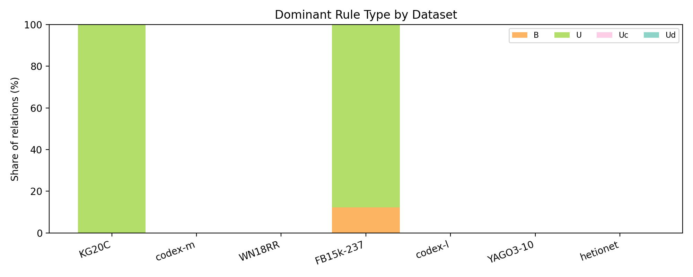
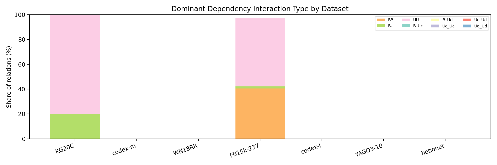
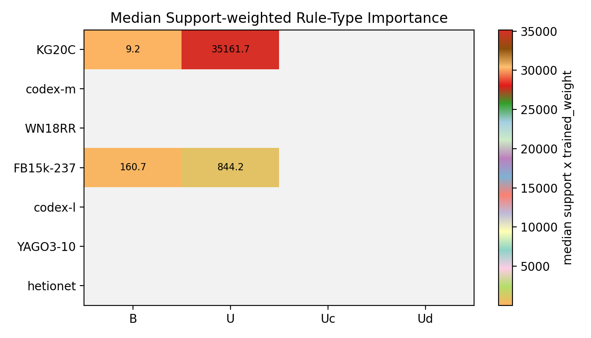

# 0407 Type-weight Analysis

这一节不再把 type weight 直接做成单个实验级平均值，而是回到 relation 粒度来问：在每个数据集最优的 typed 实验里，究竟是哪一类 rule type 或 dependency interaction 真正在起作用。

这里将某个 type 在一个 relation 上的重要性定义为：`support x trained_weight`。

- `trained_weight` 是最终学到的乘性系数，因此权重越大，说明模型越愿意放大该 type 的贡献。
- `support` 反映这个 type 在该 relation 上覆盖了多少规则或 rule pair。
- 因而 `support x trained_weight` 可以理解为该 type 在 relation 上的总“有效质量”；若某个 type 的权重小于 `1`，它的相对重要性也会自然下降。

相关表格：

- `best_typed_experiment_by_dataset.csv`
- `relation_type_weight_importance.csv`
- `dataset_type_weight_summary.csv`
- `global_type_weight_summary.csv`

<em>Figure 1: share of relations whose dominant rule type is B / U / Uc / Ud in each dataset.</em>

<em>Figure 2: share of relations whose dominant dependency interaction type differs across datasets.</em>

<em>Figure 3: median support-weighted importance of each rule type in each dataset.</em>

## Best Typed Experiment Per Dataset

为了避免把“是否使用 type weight”与“type weight 学成什么样”混在一起，这里先对每个数据集只在显式带 type weight 的实验中选一个最优配置，即 `r2d3` 与 `r3d6` 二选一。

| Dataset | Best typed experiment | Grouping | Test MRR | Top rule type | Top dependency type |
| --- | --- | --- | ---: | --- | --- |
| KG20C | tg_r2d3__pos_auto_ratio__ri_conf__dn_per_rule_degree__dl1_1e-5 | r2d3 | 0.23395 | U | UU |
| codex-m | tg_rd__pos_auto_sqrt__ri_conf__dn_per_rule_degree__dl1_1e-5 | rd | 0.34480 | - | - |
| WN18RR | structural_rd | rd | 0.50219 | - | - |
| FB15k-237 | tg_r2d3__pos_auto_ratio__ri_conf__dn_none__dl1_1e-5 | r2d3 | 0.35535 | U | UU |
| codex-l | tg_rd__pos_auto_sqrt__ri_conf__dn_per_rule_degree__dl1_1e-5 | rd | 0.33418 | - | - |
| YAGO3-10 | structural_dep_scale | mixed | 0.57796 | - | - |
| hetionet | dep_scale_surprisal_init | mixed | 0.37847 | - | - |

## Dataset-level Pattern

在这批结果中，最佳 typed 实验的 grouping 分布为 `r2d3 = 2`，`r3d6 = 0`。 但这一步只是选择分析入口，真正关键的是进入该实验后，不同 relation 对不同 type 的偏好是否一致。

按 relation 计数，整体上最常成为主导项的 rule type 是 `U`，最常成为主导项的 dependency interaction 是 `UU`。

## Within-dataset Heterogeneity

下面的统计更能说明问题：如果某个数据集所有 relation 都偏好同一种 type，那么它的 dominant-type entropy 会很低；反过来，如果不同 relation 各自依赖不同的 type，entropy 就会更高。

- `KG20C`: dominant rule type 最常见的是 `U`，占 `100.00000%`；rule-type entropy 为 `0.00000`，dependency-type entropy 为 `0.72193`。
- `codex-m`: dominant rule type 最常见的是 `-`，占 `0.00000%`；rule-type entropy 为 ``，dependency-type entropy 为 ``。
- `WN18RR`: dominant rule type 最常见的是 `-`，占 `0.00000%`；rule-type entropy 为 ``，dependency-type entropy 为 ``。
- `FB15k-237`: dominant rule type 最常见的是 `U`，占 `87.76371%`；rule-type entropy 为 `0.53611`，dependency-type entropy 为 `0.68889`。
- `codex-l`: dominant rule type 最常见的是 `-`，占 `0.00000%`；rule-type entropy 为 ``，dependency-type entropy 为 ``。
- `YAGO3-10`: dominant rule type 最常见的是 `-`，占 `0.00000%`；rule-type entropy 为 ``，dependency-type entropy 为 ``。
- `hetionet`: dominant rule type 最常见的是 `-`，占 `0.00000%`；rule-type entropy 为 ``，dependency-type entropy 为 ``。

## What Is Important In Each Dataset

如果把“更重要”理解为 `support x trained_weight` 更高，那么不同数据集的主导 type 确实明显不同。

- `KG20C`: rule 侧最重要的 type 是 `U`，median importance `35161.71603`；dependency 侧最重要的 interaction 是 `BU`，median importance `8791.79256`。
- `codex-m`: rule 侧最重要的 type 是 `-`，median importance ``；dependency 侧最重要的 interaction 是 `-`，median importance ``。
- `WN18RR`: rule 侧最重要的 type 是 `-`，median importance ``；dependency 侧最重要的 interaction 是 `-`，median importance ``。
- `FB15k-237`: rule 侧最重要的 type 是 `U`，median importance `844.24132`；dependency 侧最重要的 interaction 是 `UU`，median importance `931.16214`。
- `codex-l`: rule 侧最重要的 type 是 `-`，median importance ``；dependency 侧最重要的 interaction 是 `-`，median importance ``。
- `YAGO3-10`: rule 侧最重要的 type 是 `-`，median importance ``；dependency 侧最重要的 interaction 是 `-`，median importance ``。
- `hetionet`: rule 侧最重要的 type 是 `-`，median importance ``；dependency 侧最重要的 interaction 是 `-`，median importance ``。

## Representative Relation-level Diversity

relation 级别的差异并不会被数据集平均值完全解释。下面列出若干代表性 relation，展示同一数据集内部也会出现不同的主导 type。

- `KG20C` / `paper_in_domain`: dominant rule type = `U`, weight `1.86721`, support `101313.00000`, importance `189172.97093`; dominant dependency type = `UU`.
- `FB15k-237` / `/film/actor/film./film/performance/film`: dominant rule type = `U`, weight `2.57158`, support `27826.00000`, importance `71556.82404`; dominant dependency type = `BB`.
- `FB15k-237` / `/base/biblioness/bibs_location/country`: dominant rule type = `B`, weight `1.28215`, support `966.00000`, importance `1238.55535`; dominant dependency type = `BB`.

## Interpretation

这次按 relation 粒度重做后，可以看到 type weight 的作用并不是“整个实验学到一组固定的全局偏好”，而更像是模型针对不同 relation 的局部结构自适应地调整不同 type。

因此，第 4 部分更合理的结论不该是“某个 grouping 的全局平均权重大小关系如何”，而应当是：

- 不同数据集的主导 rule type 和主导 dependency interaction 确实不同。
- 同一数据集内部，不同 relation 的 dominant type 也会显著变化。
- `Ud < B < Uc` 若要分析，也应在 relation 级别或数据集级别检查其成立比例，而不是只看被平均之后的一组数字。
