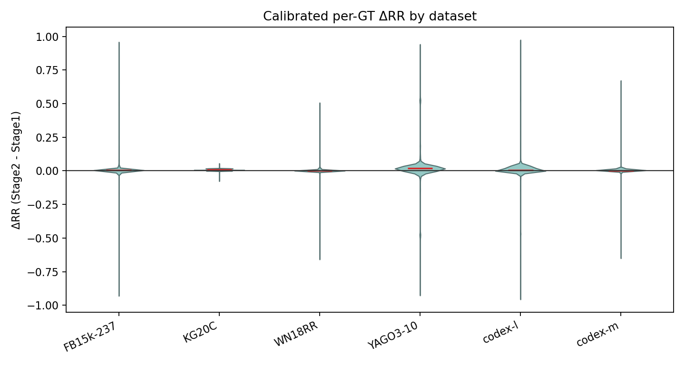
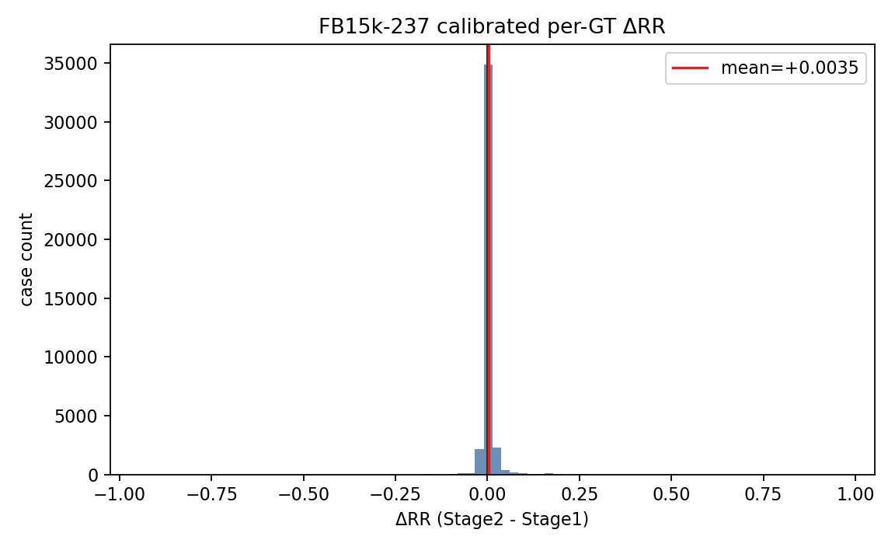
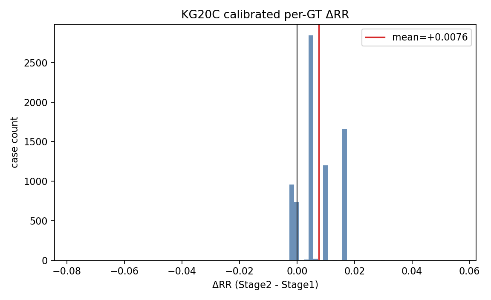
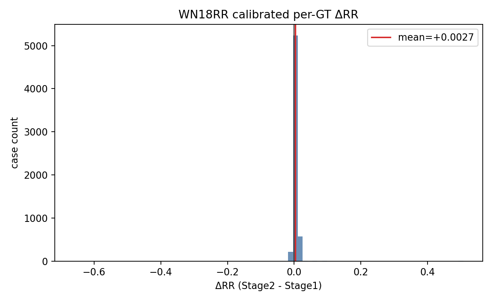
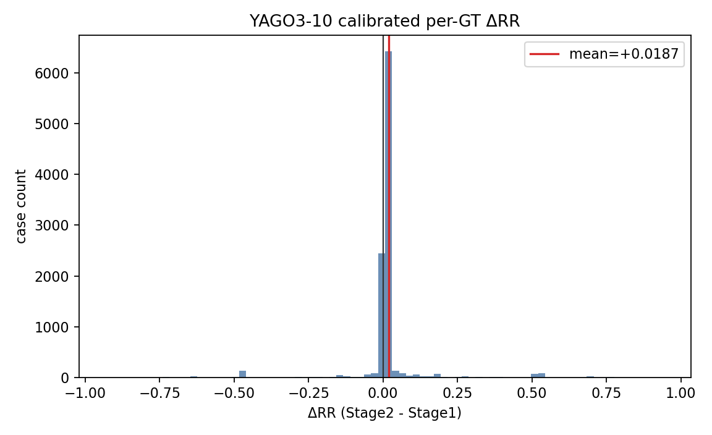
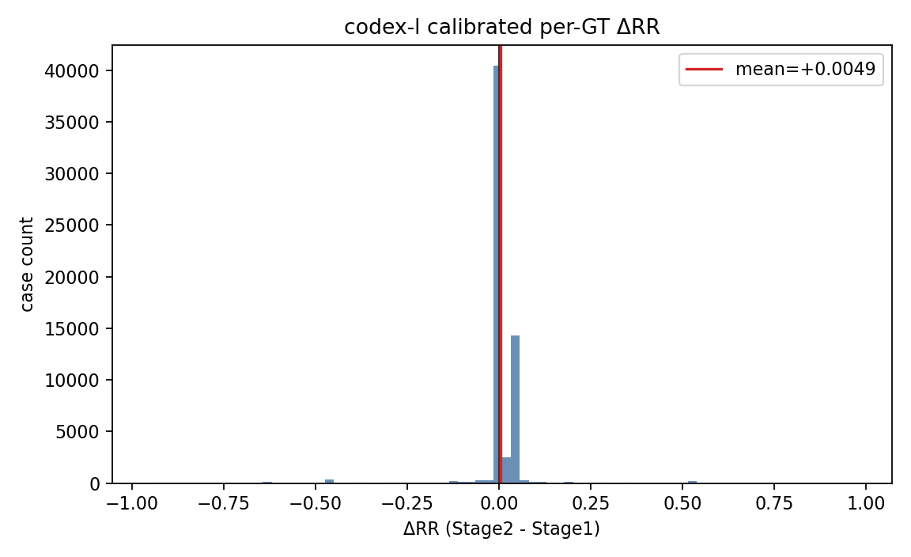
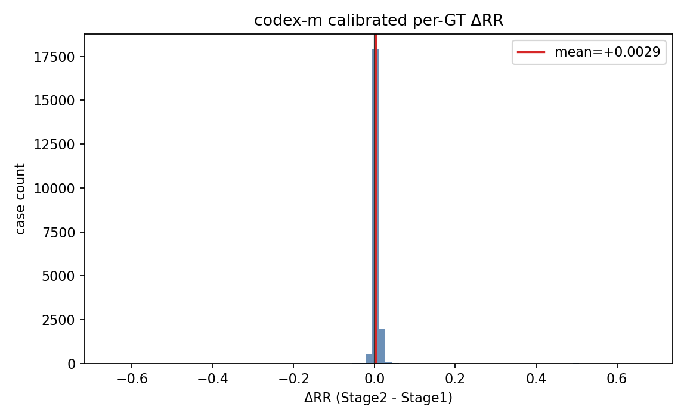

# Query-level Delta MRR Distribution

Generated from `reports/query_analysis/query_case_level_analysis.csv`.

Notes:

- Rows are per-GT cases, not merged multi-GT queries.
- `delta_rr` is relation-level calibrated so each relation mean matches official `test_after_stage2.mrr - test_after_stage1.mrr`.
- Raw demo-derived values are retained in `raw_rr_stage1`, `raw_rr_stage2`, and `raw_delta_rr`.

## Combined

## Per Dataset

### FB15k-237

### KG20C

### WN18RR

### YAGO3-10

### codex-l

### codex-m

